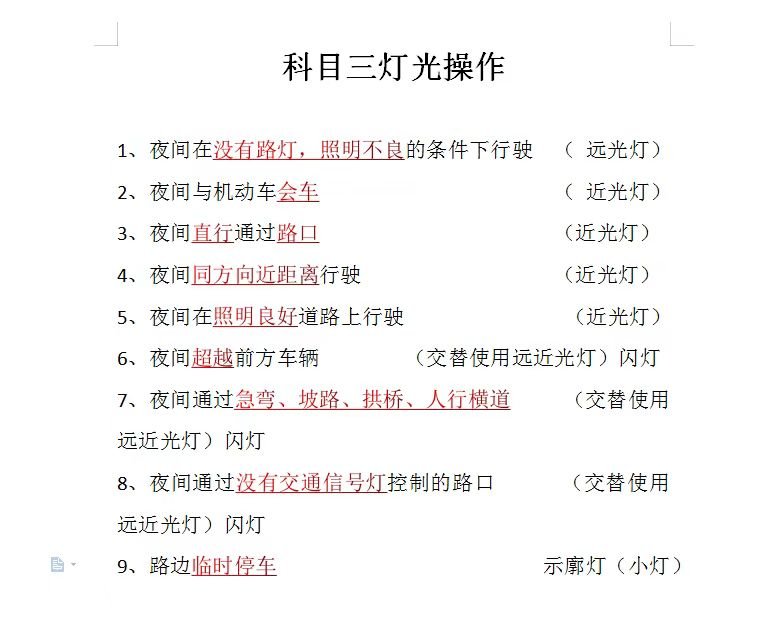
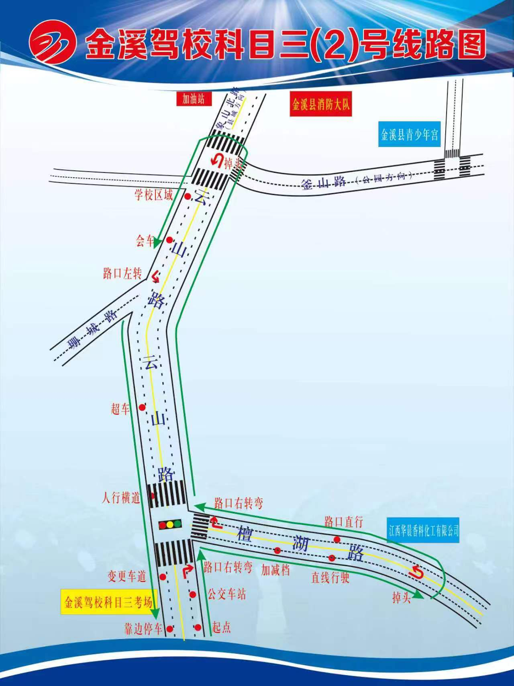
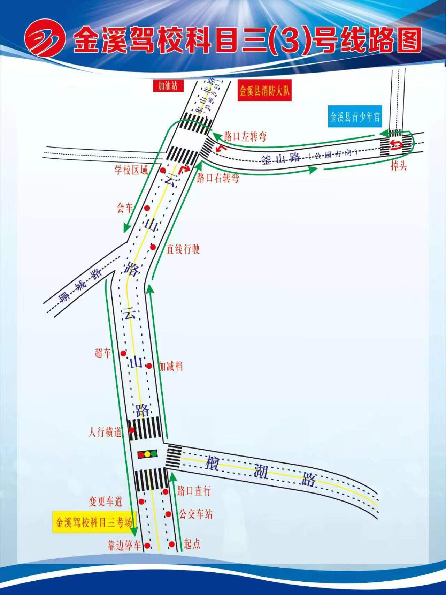

## 科目三

### 基本操作

1、打火

先踩离合和刹车，钥匙向右转第一下，电源打着了，然后转第二下，看到仪表盘指针打火到1左右即打火成功

2、熄火

钥匙往回转两下 指针到0

3、转向灯

**灯光**

左边 往右转第一下，这是示廓灯，第二下是近光灯 记得关闭

远光灯的话方向盘左边是灯杆，往前推一下是远光灯，往回拨一下关闭

交替远近光灯 即往回拨三下 

**转向灯**

也是在灯杆上操作的

左转向灯灯杆向下，右转向灯灯杆向上

**雨刮器**

方向盘右杆，然后向上推，一共低速、中速、高速三个档位

**档位使用**

挂挡要踩离合和刹车

往左推到底然后向上，换挡时一定先回空挡，停顿一下

科目三就这四个档位

五档就是右靠然后前推 R档向下按在左上

### 灯光考试：

开始前先开近光灯，然后听语音播报

规则如下

其实你可以从中发现规律

1、基本是近光灯

2、照明差、没路灯 远光灯

3、临时停车小灯

4、夜间超车、没有交通信号灯的路口、路况差（急弯、坡路、拱桥、人行横道）的地方 闪灯

细节：如果前一个是远光灯，然后当前是近光灯了，那么要把灯杆归原位，等等类似场景一样比如小灯转近光灯

然后闪灯拨玩是自动回来的

考试结束后 关闭所有灯光！

### 线路摸索

### 练车经验

打灯的时候 好像那个灯杆老是关不了 那个应该是闪几下会自动回

换挡：油门全部放掉，然后离合踩到底，换挡，换完后缓慢放掉离合

点刹：就是轻轻点一下刹车，注意只是稍微降速，踩刹车过多可能导致熄火

如果你是要停车，即紧急制动，需要踩到离合然后踩刹车，不然会熄火，但是如果你是点刹，例如路口、会车这种轻轻踩即可

如果在靠边停车项目，前方有车子，你可以踩刹车挂空挡，然后让车慢慢溜下去，挂一档，然后溜几秒挂档

### 汽车理论

怎么理解油门和离合的关系

离合器作用是控制汽车轮子和发动机的离与合，离合器抬着时发动机和轮子连在一起，发动机给车子提供动力，离合器被踩下时发动机和轮子分离车子失去动力

踩油门是给发送机增加转速，踩下油门汽油点燃为发动机提供动力，增加其转速使汽车行驶更快	

开车大多数时间是不需要离合的，左脚大多时间靠在离合器左侧休息踏板处

变道方向盘只是稍微移一点点，幅度不是很大，当车超过半个身位就要回正，同时转向灯回正，并且变道前要看看变道的车道上有没有车

转弯遇到箭头要减速

### 考试实战

1、开始阶段

首先人坐上去 核验身份后 考灯光 灯光结束 关灯 环绕车辆 看右后方、左前方的两个轮胎气压和胎位

然后上车 寄好安全带 准备起步

2、结束阶段

靠边停车结束后，回空挡，拉手刹，关转向灯，然后车钥匙驳回，注意好安全后开车门

3、靠边停车原理

听到靠边停车播报，然后就往右带一点方向，让车慢慢斜着走，然后看小镜，差不多压线了，然后再向左走一点点

把车身修正，然后停车

### 考前提醒

1、考试要带身份证

## 科目四

### **ABS紧急制动**

单选题巧记找力字，有力字的打对

判断题：ABS有缩短的打错 没有缩短的打对

### 制动方式

1、行车制动 即脚刹

2、发动机制动 拖档走 即挂档后不踩油门，靠发动机转速下降来制动减速

3、驻车制动 手刹

4、紧急制动 迅速全力踩刹车踏板

其实我们在路上行驶保持车辆匀速稳定前进，主要靠发送机制定

### 交警手势

1、如果交警看你 那就是对你发号施令

2、手心对你 让你停下来 有停车等待直接选

3、两只手一高一低 转弯，哪只手在下就往哪里转

4、两只手一条线就是直行  不动也直行

### 动画题：

动画12378 两种违法 动画456三种违法

有标志牌的打对，没有标志牌的打错

修正打对

反方向修正打错

### 手势判断题

交警看我们打对 不看我们打错

**信号灯题**

三个灯竖着打对 横着打错

**标志牌**

方形白色正确

### 错题

1、交警手势

还是记住 如果看着你选正确 没有选错误

2、分清楚掉头车道 只能掉头 不能左转

3、泥泞车道要适当减速通过，也要提前换入低速挡，要注意

4、发动机故障是CHECK 那个加油的是燃油指示灯

5、进出隧道要适当减速

6、提示前方有塌方 要减速慢行 小心通过

7、在恶劣气象和复杂道路条件下 山区道路安全驾驶

要：保持距离、避免占道、上坡换低速档、下长坡发动机制动

8、进双向隧道要打开示廓灯或近光灯

9、右转弯需要变更车道，不能压实线

10、爆胎后要先稳住方向 再慢慢减速

11、能见度过低导致行车困难时 要选择安全地点停车了

12、当侧滑了不能向相反方向修正，要侧滑一侧适当修正

13、机动车发动机着火 要先迅速关闭发动机 然后再考虑灭火

14、安全带在车辆碰撞时作用是减轻驾乘人员受伤程度！

15、社会车辆不应占用出租停车位临时停车

16、如果直行信号为红色不能进左转待转区，只有直行信号灯为绿色同时左转信号灯为红色才可

17、先避人后避物

18、下坡路段 可以利用路边避险车道减速停车

 

19、燃油着火时 不能用水灭火 因为油会浮在水表面

20、完成超车应开启右转向灯 驶回原车道

21、当驾车驶入环岛不开转向灯，驶出环岛打右转向灯

22、当没有信号灯时，应该转弯让直行，右转让左转

23、夜间起步还是要近光灯+左转向灯

24、驾驶机动车下长坡，如果连续使用行车制动，制动器温度会升高导致制动效果急剧下降，这种情况最好用低速挡行驶 使用发动机制动减速

25、雾天能见度小于200m，要开启灯光车速不能超过60km/h，

能见度小于100米 车速不超40

能见度小于50米 车速不超过20km 并从最近出口走

26、开始下雨的路面最容易侧滑，冰雪路面最容易抱死

27、警告标志应该在150米处设置 大雾天人要站在护栏外安全的地方

28、装有动力转向的车辆，如果发现转向困难，那说明车辆故障，应该停车检查

29、上坡时阻力较大，可以提前减档，否则可能车速和档位不匹配导致熄火或是溜车

30、发生火灾时应关闭发动机，留下车钥匙，弃车逃生

31、机动车发动机着火时，开启发动机罩会使得氧气更充足火势更大

32、头枕中心要能支撑头部

33、谨记一条原则：能停车就选停车的

34、雾天因雾气形成小水珠应及时用雨刮器刮净

35、加速车道汇入行车道 不能停车

36、高速公路、大雾天 不能瞎扯

37、不要轻易跳车，小撞击车内更安全

38、有时也要看路况、可能是靠左侧减速让行

39、匝道车速看标志

40、右转弯三注意 前方车辆、右侧盲区、人直穿

41、鸣喇叭不一定是错、但连续鸣笛肯定有问题

42、请区分交替使用远近光灯，而不是不停变换

43、危险报警闪光灯不能乱开

44、先止血包扎然后再固定